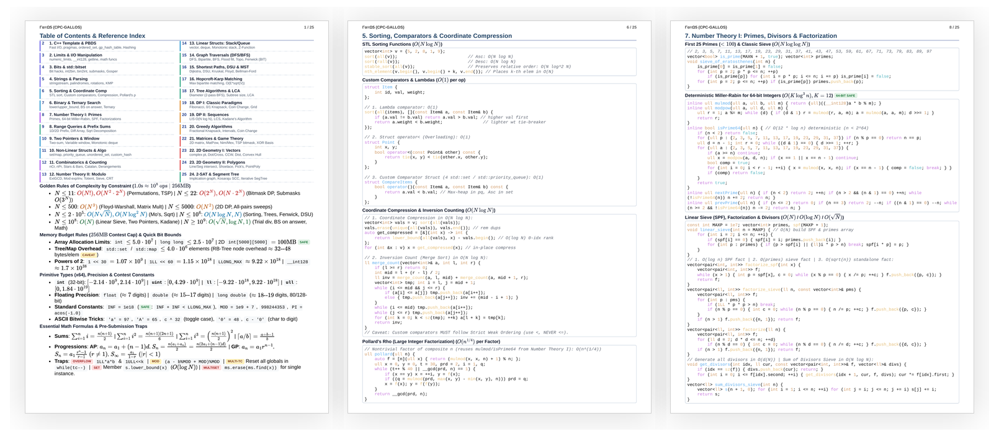

# CPC Gallos Notebook - Team Reference Document (TRD)

> **ICPC-Compliant 25-Page Competitive Programming Reference Document (Notebook / Cheat Sheet)**  
> Maintained by **[CPC Gallos](https://github.com/CPC-GALLOS)** (Club de Programación Competitiva Gallos) @ Universidad Autónoma de Aguascalientes (UAA).

---

## Overview

This repository contains the complete **ICPC Team Reference Document (TRD)** formatted and styled according to the official ICPC World Finals / Regional on-site reference rules.

Built with **[Marp](https://marp.app/)** and a custom CSS theme (`src/us-letter-light.css`), it compiles directly to an ultra-compact, high-density, legible 25-page PDF (reaching 100% of the strict $\le 25$-page single-sided limit).

---

## Preview

<p align="center">
  <a href="https://github.com/CPC-GALLOS/Notebook/releases/latest/download/Notebook-TRD.pdf">
    
  </a>
</p>

<p align="center">
  <a href="https://github.com/CPC-GALLOS/Notebook/releases/latest"></a>
  <a href="https://github.com/CPC-GALLOS/Notebook/releases/latest/download/Notebook-TRD.pdf"></a>
</p>

<p align="center">
  <b><a href="https://github.com/CPC-GALLOS/Notebook/releases/latest/download/Notebook-TRD.pdf">📄 Descargar / Ver el PDF oficial de 25 páginas (Latest Release)</a></b>
</p>

---

## ICPC TRD Official Rules & Regulations

*(Source: [ICPC World Finals On-Site Registration](https://icpc.global/worldfinals/on-site-registration))*

1. **25-Page Limit**: At most **25 single-sided pages** (Letter or A4 size), numbered in the **upper right-hand corner**.
2. **Mandatory Header**: Your **University Name and Team Name** must be printed in the **upper left-hand corner** on every page.
3. **1/2 Meter (50 cm) Legibility**: All text and illustrations must be readable without magnification from a distance of **1/2 meter**.
4. **Printed Side Only**: Handwritten notes and corrections are allowed on the **fronts of pages only** (the reverse side must remain blank).
5. **Notebook / Folder Presentation**: Must be in a notebook or folder with the **name of your institution on the front**.

> [!WARNING]
> **Customize Your Team Header Before Printing for On-Site Contests**:
> To comply with official ICPC on-site regulations (Requirement #2 above), make sure to update the `header` field in the YAML frontmatter of [`Notebook-TRD.md`](./Notebook-TRD.md) (line 6) with your **Institution Name and Team Name** before generating your printed PDF:
> ```yaml
> header: "Your Institution — Team Name"
> ```

---

## Why Exclusively C++?

This Team Reference Document is written **exclusively in C++**. The motivation, benchmarks, and architectural decisions behind this choice are detailed in the CPC Gallos article [**¿Por qué C++?**](https://cpc-gallos.github.io/blog/Por_que_Cpp/):

1. **Universal Support Across Contests**: C++ is universally available across all official competitive programming platforms (ICPC, IOI, Codeforces, AtCoder, CSES).
2. **Raw Speed & Minimal Memory Overhead**: Compiles directly to native x86/ARM machine code with zero garbage collection or Virtual Machine (JVM) overhead, avoiding the severe execution penalties of Python ($\sim 70\times$ slower) and the heavy memory footprint of Java/Kotlin.
3. **Standard Template Library (STL) & PBDS**: Out-of-the-box access to highly optimized data structures (`vector`, `deque`, `priority_queue`, `bitset`, `set`, `map`) and GCC extensions like Policy-Based Data Structures (`ordered_set`, `gp_hash_table`).
4. **Fast I/O & Hardware-Level Bit Intrinsics**: Unsynchronized fast streams (`cin.tie(0)->sync_with_stdio(0)`), compiler intrinsics (`__builtin_popcount`, `__builtin_clz`), and 128-bit integers (`__int128`) ensure routines pass strict $1.0\text{s}$ ICPC time limits ($O(10^8)$ operations/sec).

For full empirical benchmarks (including normalized execution speed, memory footprint, and the Sieve of Eratosthenes benchmark across C, C++, Rust, Java, Kotlin, and Python), see the full article: [https://cpc-gallos.github.io/blog/Por_que_Cpp/](https://cpc-gallos.github.io/blog/Por_que_Cpp/).

---

## Table of Contents & Topic Index

|  Page  | Section                                   | Key Topics & Algorithms                                                                                                                                                                                                        |
| :----: | :---------------------------------------- | :----------------------------------------------------------------------------------------------------------------------------------------------------------------------------------------------------------------------------- |
| **1**  | **Table of Contents & Index**             | 2-Column Master Index, Golden Rules of Complexity by Constraint ($1.0\text{s} \approx 10^8\text{ ops}$), Memory Budget Rules ($256\text{MB}$ Cap), Primitive Types & Constants, Essential Math Formulas & Pre-Submission Traps |
| **2**  | **1. C++ Competitive Template & PBDS**    | Fast I/O, optimization pragmas & caveats, `__gnu_pbds` (`ordered_set`, `gp_hash_table`), local benchmark timer, standard macros, String Hashing (rolling hash)                                                                 |
| **3**  | **2. Limits, I/O & Math Utilities**       | `numeric_limits`, float precision, `getchar_unlocked` fast int I/O, `__int128` fast I/O, float comparison `d_eq`, angle conversions, math functions                                                                            |
| **4**  | **3. Bit Manipulation & `std::bitset`**   | Bit hacks, GCC built-ins (`__builtin_popcount`, `clz`, `ctz`), fast `int2bin` & `bin2int`, submask iteration $O(3^N)$, `std::bitset` methods, Gosper's Hack $O(\binom{N}{K})$                                                  |
| **5**  | **4. String Manipulation & Parsing**      | Substrings, find/replace, char $\leftrightarrow$ digit conversions, `stringstream` tokenization, CSV splitting, palindromes, cyclic shifts, KMP $\pi$-function, Trie (prefix tree) insert & prefix count $O(L)$                |
| **6**  | **5. Sorting & Coordinate Comp**          | `sort`, `stable_sort`, `nth_element`, custom struct & lambda comparators, $O(N \log N)$ coordinate compression & Inversion Count (Fenwick/BIT), Pollard's Rho factorization                                                    |
| **7**  | **6. Search: Binary & Ternary Search**    | `lower_bound`/`upper_bound` idioms, BS on answer template, Floating/Continuous Binary Search, Discrete & Continuous Ternary Search                                                                                             |
| **8**  | **7. Number Theory I: Primes & Fact**     | First 25 primes, deterministic 64-bit Miller-Rabin ($n < 2^{64}$), Linear Sieve / SPF $O(N)$, Factorization $O(\log N)$ & $O(\sqrt{N})$, Divisors $O(d(N))$                                                                    |
| **9**  | **8. Range Queries & Prefix Sums**        | 1D & 2D Prefix Sums ($O(1)$ query), 1D Difference Array ($O(1)$ range update), Sparse Table static RMQ ($O(N \log N)$ build, $O(1)$ query)                                                                                     |
| **10** | **9. Two Pointers & Sliding Window**      | Two-sum sorted, variable sliding window (at most $K$ distinct), Monotonic Deque sliding window minimum $O(N)$                                                                                                                  |
| **11** | **10. Non-Linear Structs & Algorithms**   | `std::set`, `std::multiset` erase, `std::map`, `std::multimap` (`equal_range`), `priority_queue`, `map` vs `unordered_map`/`unordered_set` vs `gp_hash_table` Big-O, `custom_hash` struct, `<numeric>` & `<algorithm>`         |
| **12** | **11. Combinatorics & Counting**          | Factorials & $\binom{n}{r}$ precomputation, Stars & Bars, Catalan numbers, Derangements, Inclusion-Exclusion, Lucas' Theorem                                                                                                   |
| **13** | **12. Number Theory II: Modular Math**    | Extended GCD, Modular exponentiation & inverse (Fermat & ExtGCD), Euler's Totient $\phi(n)$, Segmented Sieve, Chinese Remainder Theorem (CRT)                                                                                  |
| **14** | **13. Linear Structures & Stack/Queue**   | `std::vector`, `std::deque`, `std::stack`, `std::queue`, Monotonic Stack (NGE & Largest Rectangle in Histogram $O(N)$), circular array cyclic traversal, Z-Function pattern matching                                           |
| **15** | **14. Graph Traversals: DFS, BFS**        | Graph representations, DFS, Bipartite check (2-coloring), BFS unweighted shortest path, 2D Grid Flood Fill, Topological Sort (Kahn's), Fenwick Tree (BIT) point update & prefix sum $O(\log N)$                                |
| **16** | **15. Shortest Paths, DSU & MST**         | Dijkstra $O((V+E)\log V)$, DSU (rank & size), Kruskal's MST $O(E \log E)$, Floyd-Warshall $O(V^3)$, Bellman-Ford & Negative Cycles $O(VE)$, N-ary/Ternary Tree node representations                                            |
| **17** | **16. Hopcroft-Karp Bipartite Matching**  | Maximum bipartite matching via layered BFS + augmenting-path DFS, $O(E\sqrt{V})$                                                                                                                                               |
| **18** | **17. Tree Algorithms & LCA**             | 2-pass BFS Tree Diameter $O(N)$, Subtree sizes & depths, Lowest Common Ancestor (Binary Lifting) $O(N \log N)$ prep / $O(\log N)$ query, Euler Tour Technique $O(N)$                                                           |
| **19** | **18. Dynamic Programming I: Classic**    | Fibonacci (Top-down & Bottom-up $O(1)$ space), 0/1 & Unbounded Knapsack (1D space-optimized), Coin Change (min coins & ways), Grid Paths w/ obstacles                                                                          |
| **20** | **19. Dynamic Programming II: Sequences** | Longest Increasing Subsequence (LIS) in $O(N \log N)$ + reconstruction, LCS $O(NM)$ + reconstruction, Kadane's algorithm                                                                                                       |
| **21** | **20. Greedy Algorithms & Paradigms**     | Fractional Knapsack $O(N \log N)$, Interval Scheduling / Activity Selection, Canonical coin change, 2D Kadane / Maximum Submatrix Sum $O(R^2 C)$                                                                               |
| **22** | **21. Matrices & Game Theory**            | 2D Matrices, compass deltas, in-place $90^\circ$ rotation, Matrix Multiplication $O(N^3)$, Matrix Exponentiation $O(N^3 \log K)$, Nim Game & Mex, TSP Bitmask DP $O(2^N \cdot N^2)$, XOR Basis (linear basis over $GF(2)$)     |
| **23** | **22. 2D Computational Geometry I**       | `std::complex` vector primitives, dot & cross products, CCW orientation test, point projection & reflection, point-to-line/segment distance, Convex Hull (Monotone Chain) $O(N \log N)$                                        |
| **24** | **23. 2D Computational Geometry II**      | Line-line & segment-segment intersection, Polygon Area (Shoelace Formula), Pick's Theorem, Point-in-Polygon (Ray-Casting), 3-Point Circumcircle $O(1)$                                                                         |
| **25** | **24. 2-SAT & Segment Tree**              | 2-SAT via implication graph & Kosaraju SCC (`TwoSat`, `addClause`, `solve`), Iterative Segment Tree (bottom-up point update & range query)                                                                                     |

> **Why not a 2-column layout?** We know a 2-column layout on content pages would let us fit noticeably more code per page. We deliberately kept every content page single-column instead, for readability. If you'd rather trade some readability for more coverage, this repo is built exactly for that: fork it and tune `src/us-letter-light.css` to your taste!

---

### Golden Rules of Complexity by Constraint ($1.0\text{s} \approx 10^8\text{ ops} \mid 256\text{MB}$)

| Input Size ($N$)                       | Maximum Complexity                                   | Typical Paradigms / Techniques                                          |
| :------------------------------------- | :--------------------------------------------------- | :---------------------------------------------------------------------- |
| **$N \le 11$**                         | $O(N!) \text{ or } O(N^2 \cdot 2^N)$                 | Brute-force permutations (`next_permutation`), TSP exact                |
| **$N \le 18\text{--}22$**              | $O(2^N) \text{ or } O(N \cdot 2^N)$                  | Bitmask DP, Meet-in-the-middle, Submasks $O(3^N)$                       |
| **$N \le 400\text{--}500$**            | $O(N^3)$                                             | Floyd-Warshall, Matrix Multiplication, Interval DP                      |
| **$N \le 2\,000\text{--}5\,000$**      | $O(N^2)$                                             | 2D DP ($N \times W$), All-pairs pairwise checks                         |
| **$N \le 10^5\text{--}2 \times 10^5$** | $O(N \sqrt{N}) \text{ or } O(N \log^2 N)$            | Mo's algorithm, Sqrt decomposition                                      |
| **$N \le 5 \times 10^5\text{--}10^6$** | $O(N \log N) \text{ or } O(N)$                       | Sorting, Segment Tree, Fenwick, DSU, Dijkstra                           |
| **$N \le 10^7\text{--}10^8$**          | $O(N)$                                               | Linear Sieve (SPF), Two Pointers, Sliding Window, Kadane                |
| **$N \ge 10^9$**                       | $O(\sqrt{N}) \text{ or } O(\log N) \text{ or } O(1)$ | Trial division factorize, Binary search on answer, Math closed formulas |

* **Memory Rules ($256\text{MB}$ Limit)**: `int` $\le 5.0 \times 10^7$, `long long` $\le 2.5 \times 10^7$, 2D `int[5000][5000]` $= 100\text{MB}$ (fits), `std::set`/`std::map` $\le 4.0 \times 10^6$ elements.

---

## How to Compile to PDF

### Option 1: Command Line (Marp CLI)
Make sure you have Node.js installed, then run:

```bash
# Compile Notebook-TRD.md to Notebook-TRD.pdf using the custom US Letter theme:
npx -y @marp-team/marp-cli Notebook-TRD.md --theme-set src/us-letter-light.css --allow-local-files --pdf -o Notebook-TRD.pdf
```

### Option 2: VS Code Extension
1. Install the official [Marp for VS Code](https://marketplace.visualstudio.com/items?itemName=marp-team.marp-vscode) extension.
2. Open [`Notebook-TRD.md`](./Notebook-TRD.md).
3. Open the Command Palette (`Ctrl+Shift+P` / `Cmd+Shift+P`), type **`Marp: Export Slide Deck...`**, and select **PDF**.

---

## Repository Structure

```text
.
├── Notebook-TRD.md          # Master ICPC Reference Document source (Marp Markdown)
├── Notebook-TRD.pdf         # Compiled 25-page printable reference PDF
├── README.md                # Documentation and build instructions
├── LICENSE                  # CC BY-SA 4.0 License
└── src/
    ├── us-letter-light.css  # Custom CSS theme for US Letter single-sided printing
    ├── containers.png       # C++ STL container decision flowchart
    └── preview.png          # README preview thumbnail strip
```

---

## References & Literature (Exact Code Attribution)

The algorithms, theorems, and implementations in this notebook are sourced and adapted from the following literature cataloged at [CPC Gallos — Recursos](https://cpc-gallos.github.io/blog/Recursos/) and open-source libraries:

### Original CPC Gallos Content
* **Ariel Parra** — [Template](https://cpc-gallos.github.io/blog/Template/), CPC Gallos blog: the club's own long-form C++ competitive template — TLE pragmas (`Ofast,unroll-loops`, `avx2` target), `bits/stdc++.h` + type aliases (`ll`, `ull`), the `ios::sync_with_stdio(0); cin.tie(0);` fast I/O setup, `#define endl '\n'`, and `#define all(x)` — is the direct basis for Section 1's C++ Template & PBDS.
* **Ariel Parra**: `int2bin`/`bin2int` binary-vector conversion helpers (Section 3) and the circular string rotations helper (Section 4) are original club implementations, credited inline in the code comments where they appear.

### Team & Personal Acknowledgments
* **Karim Zaafrani** ([LinkedIn](https://www.linkedin.com/in/karim-zaafrani-148868209/)) — teammate at **UTCode**, SWERC 2025: this notebook's Iterative Segment Tree and 2-SAT (both Section 24), Hopcroft-Karp Bipartite Matching (Section 16), String Hashing (Section 1), Pollard's Rho (Section 5), Z-Function (Section 13), and XOR Basis (Section 21) are adapted directly from his team's notebook/cheatsheet/TRD, `UTcode_SWERC_2025.pdf`. Huge thanks, Karim, for putting that reference together and sharing it!

### Competitive Programming Books & Academic Literature
* **Antti Laaksonen** — [*Competitive Programmer’s Handbook*](https://cses.fi/book/book.pdf) & [*Guide to Competitive Programming*](https://web.archive.org/web/20240416164948/https://edisciplinas.usp.br/pluginfile.php/7933913/course/section/6549987/Antti%20Laaksonen%20-%20Guide%20to%20Competitive%20Programming_%20Learning_Version2.pdf) (Springer):
  - **Golden Rules of Complexity by Constraint**: the $N$-to-feasible-complexity table keyed to the $\approx 10^8$ ops/sec, 1-second budget heuristic, adapted from CPH's "Estimating Efficiency" section (Table of Contents & Reference Index page).
  - **Submask Enumeration**: $O(3^N)$ all-submasks loop `for (int s = m; s; s = (s - 1) & m)` (Section 3).
  - **Coordinate Compression**: `sort` + `unique` + `lower_bound` indexing (Section 5).
  - **2-Pass BFS Tree Diameter**: Double BFS endpoint search (Section 17).
* **Henry S. Warren Jr.** — [*Hacker’s Delight*](https://en.wikipedia.org/wiki/Hacker%27s_Delight) (Addison-Wesley):
  - **Gosper's Hack**: Next lexicographical permutation of $k$ set bits (Section 3).
  - **Bit Manipulation Idioms**: Isolate LSB `x & -x`, clear LSB `x & (x - 1)`, power-of-2 check `!(x & (x - 1))` (Section 3).
* **Thomas H. Cormen, Charles E. Leiserson, Ronald L. Rivest, Clifford Stein (CLRS)** — [*Introduction to Algorithms*](https://mitpress.mit.edu/9780262046305/introduction-to-algorithms/) (MIT Press):
  - **0/1 Knapsack & Longest Common Subsequence (LCS)**: Dynamic programming state transitions (Sections 18 & 19).
  - **Fractional Knapsack & Interval Scheduling**: Greedy activity selection (Section 20).
  - **Matrix Multiplication & Exponentiation**: Cache-efficient row-major arithmetic and divide-and-conquer powers (Section 21).
* **Darren Yao** — [*An Introduction to the USA Computing Olympiad*](https://darrenyao.com/usacobook/cpp.pdf):
  - **`std::multiset` Single-Element Erase**: `ms.erase(ms.find(x))` erase-by-iterator idiom (Section 10).
  - **2D Prefix Sums & 1D Difference Array**: Submatrix $O(1)$ query and range add logic (Section 8).
* **Sanjoy Dasgupta, Christos H. Papadimitriou, Umesh V. Vazirani** — [*Algorithms*](https://web.archive.org/web/20160113140911/http://algorithmics.lsi.upc.edu/docs/Dasgupta-Papadimitriou-Vazirani.pdf) (McGraw-Hill):
  - **Kahn's Topological Sort**: Indegree queue-based DAG linear ordering (Section 14).
  - **Dijkstra's Shortest Path**: $O((V + E) \log V)$ min-heap traversal (Section 15).
  - **Kruskal's MST, Floyd-Warshall & Bellman-Ford**: Greedy edge sorting, all-pairs $O(V^3)$, and $O(V \cdot E)$ negative-cycle detection (Section 15).
* **Johan Sannemo** — [*Principles of Algorithmic Problem Solving*](https://web.archive.org/web/20260109192309/https://www.csc.kth.se/~jsannemo/slask/main.pdf) (KTH):
  - **Monotonic Stack**: Next Greater Element (NGE) in $O(N)$ (Section 13).
  - **Monotonic Deque**: Sliding window minimum in $O(N)$ (Section 9).
* **David Esparza & Juan Ruiz** — [*Algorithms for Competitive Programming*](https://snip.dssr.ch/?8991f4d1321aa88f#ENKw1jdtBpZ7g57N3QgQLVpNSzZ4kaw1Xyeu4iMNodab): Number theory modulo foundations (Section 12).
* **Gayle Laakmann McDowell** — [*Cracking the Coding Interview*](https://archive.org/details/cracking-the-coding-interview-6th-edition-189-programming-questions-and-solutions_202312/) (6th Ed.): Bitwise manipulation idioms (Section 3).

### Open-Source ICPC Libraries & Online Knowledge Bases
* **Gustavo Meza** — [GustavoMeza/icpc-notebook](https://github.com/GustavoMeza/icpc-notebook):
  - **LIS Sequence Reconstruction**: Backward reconstruction via parent-pointer tracking (Section 19).
  - **TSP Bitmask DP**: `tsp(mask, u)` with `dist[u][v]` transitions (Section 21).
* **KTH Royal Institute of Technology** — [KACTL (KTH Algorithm Competition Template Library)](https://github.com/kth-competitive-programming/kactl):
  - **Deterministic 64-bit Miller-Rabin**: 12 prime bases for $n < 2^{64}$ (Section 7).
  - **Wheel Prime Skip**: `nextPrime` and `prevPrime` stepping (Section 7).
  - **Monotone Chain Convex Hull**: Andrew's $O(N \log N)$ 2D hull (Section 22).
  - **Fast `__int128` I/O**: `read_int128` and `print_int128` (Section 2).
* **CP-Algorithms / E-Maxx** — [Algorithms for Competitive Programming](https://cp-algorithms.com/):
  - **KMP String Matching**: Prefix $\pi$-function computation in $O(N)$ (Section 4).
  - **Extended Euclidean Algorithm & Modular Inverse**: `extGCD(a, b, x, y)` and `modInverse` (Section 12).
  - **Linear Sieve & SPF**: Smallest Prime Factor array for $O(\log N)$ prime factorization (Section 7).
  - **Chinese Remainder Theorem (CRT)**: Pairwise coprime reconstruction (Section 12).
  - **Disjoint Set Union (DSU)**: Path compression & Union by rank/size (Section 15).
  - **Binary Indexed Tree (Fenwick)**: Point update & prefix sum queries in $O(\log N)$ (Section 14).
  - **Binary Lifting LCA**: Binary jumps table & $O(\log N)$ Lowest Common Ancestor query (Section 17).
  - **Matrix Exponentiation for Recurrences**: $O(N^3 \log K)$ transition matrix fast powers (Section 21).
* **Victor Lecomte** — [Handbook of Geometry for Competitive Programming](https://victorlecomte.com/cp-geo.pdf):
  - **`std::complex` Vector Primitives**: Dot product, 2D cross product, CCW orientation test (Section 22).
  - **Point-to-Segment & Segment Intersection**: Clamping and proper cross-check (Section 22).
  - **Shoelace Formula, Pick's Theorem & Point-in-Polygon**: Ray casting winding parity (Section 23).
* **Policy-Based Data Structures (PBDS)**: [Codeforces Blog #11080](https://codeforces.com/blog/entry/11080) by **adamant** (`ordered_set`, `order_of_key`, `find_by_order`, `gp_hash_table`) (Section 1).
* **Anti-Hash Table Hacking (`custom_hash`)**: [Codeforces Blog #62393](https://codeforces.com/blog/entry/62393) by **neal** (`splitmix64` randomized bit-mixer for hash maps) (Section 10).
* **Brace-Initialization Container Idiom**: [Codeforces Blog #15643, "C++ Tricks"](https://codeforces.com/blog/entry/15643) by **HosseinYousefi** (`p = {3, 4}` / `v = {4, 5}` over `make_pair`/explicit ctor calls) (Section 1).
* **Fast Unsynchronized `iostream` for Large Input**: the classic `ios::sync_with_stdio(false); cin.tie(nullptr);` technique (adopted via Ariel Parra's *Template*, above) traces back to [Codeforces Blog #925](https://codeforces.com/blog/entry/925) by **yak_ex** (Section 1).
* **Kamil Debowski (Errichto)** — [Errichto/contest_library](https://github.com/Errichto/contest_library): Pre-submission bug traps and edge cases checklist (Table of Contents & Reference Index page).
* **Sergey Slotin** — [Algorithmica](https://algorithmica.org/en/): Ternary search precision criteria & compiler optimizations (Section 6).
* **OI Wiki Project** — [OI Wiki (Olympic Informatics)](https://oi-wiki.org/): Sprague-Grundy theorem & Mex calculation (Section 21).
* **José Pablo ("yeipi"), Algoritmia UP** — [Structdex.cpp](https://structdex.vercel.app/): C++ data structure quick-reference. Its coverage prompted the addition of the Sparse Table (Section 8), the Trie (Section 4) and `std::multimap` (Section 10), plus the rewrite of the fast I/O setup into the chained `cin.tie(0)->sync_with_stdio(0);` one-liner (Section 1). The implementations here were written independently in their standard form, so this is a credit for the reference, not a code source.

### Foundational Algorithmic Papers & Historic Theorems
* **A. M. Andrew (1979)**: *Another efficient algorithm for convex hulls in two dimensions* — Monotone Chain Convex Hull in $O(N \log N)$ (Section 22).
* **Peter M. Fenwick (1994)**: *A New Data Structure for Cumulative Frequency Tables* — Binary Indexed Tree / Fenwick Tree (Section 14).
* **Joseph Born Kadane (1984)**: Maximum Subarray Sum Algorithm in $O(N)$ (Section 19).
* **Édouard Lucas (1878)**: Lucas' Theorem for $\binom{n}{r} \bmod p$ with prime moduli (Section 11).
* **Roland Sprague & Patrick Michael Grundy (1935 / 1939)**: Sprague-Grundy Theorem and impartial game theory (Section 21).
* **Sunzi (Sun Tzu, c. 3rd–5th century AD)**: *Sunzi Suanjing* — Chinese Remainder Theorem (CRT) (Section 12).

### Visual & Theme Credits
* **C++ STL Container Decision Flowchart**: Designed by **David Moore** ([CC BY-SA 3.0](https://creativecommons.org/licenses/by-sa/3.0/)), popularized via [Stack Overflow #471432](https://stackoverflow.com/questions/471432/in-which-scenario-do-i-use-a-particular-stl-container). Featured in earlier versions of this notebook, replaced in the current edition to make room for 2-SAT & Segment Tree — thanks to David Moore for the diagram nonetheless; it lives on as `src/containers.png`.
* **Printable CSS Theme**: Adapted from [A4-marp](https://github.com/stanfrbd/A4-marp) by Stanislas Medrano ([@stanfrbd](https://github.com/stanfrbd)) with Atom One Dark syntax palette by Daniel Gamage.

### Standard Conventions Without a Single Traceable Source
A handful of items in this notebook are common competitive-programming conventions repeated across countless independent templates and resources, with no single canonical origin to credit; rather than assign a source arbitrarily, they are named here explicitly. If you are the original author of any of these routines or know of an earlier canonical reference, feel free to open an issue or email **[cpc.gallos@gmail.com](mailto:cpc.gallos@gmail.com)** — we will be glad to add your name and attribution!
* **Memory Budget Rules & Primitive Types tables** (Table of Contents & Reference Index page): generic arithmetic (256MB ÷ sizeof(type)) repeated across virtually every CP notebook.
* **`getchar_unlocked` fast integer reader** (Section 2): standard unbuffered I/O idiom, ubiquitous across competitive C++ templates.
* **Basic DFS/BFS, Bipartite Check & Flood Fill** (Section 14): textbook graph traversal taught identically in nearly every algorithms course/resource.
* **Elementary combinatorics identities** — Stars & Bars, Catalan recurrence, Derangements, Pigeonhole Principle (Section 11): standard results found in any combinatorics reference, not specific to one book cited above.
* **Sparse Table (static RMQ)** (Section 8) and **Trie (prefix tree)** (Section 4): canonical textbook structures whose sparse-table doubling loop and 26-ary trie node layout are written near-identically across every CP resource.

---

## License

This repository is licensed under the [Creative Commons Attribution-ShareAlike 4.0 International License (CC BY-SA 4.0)](./LICENSE).